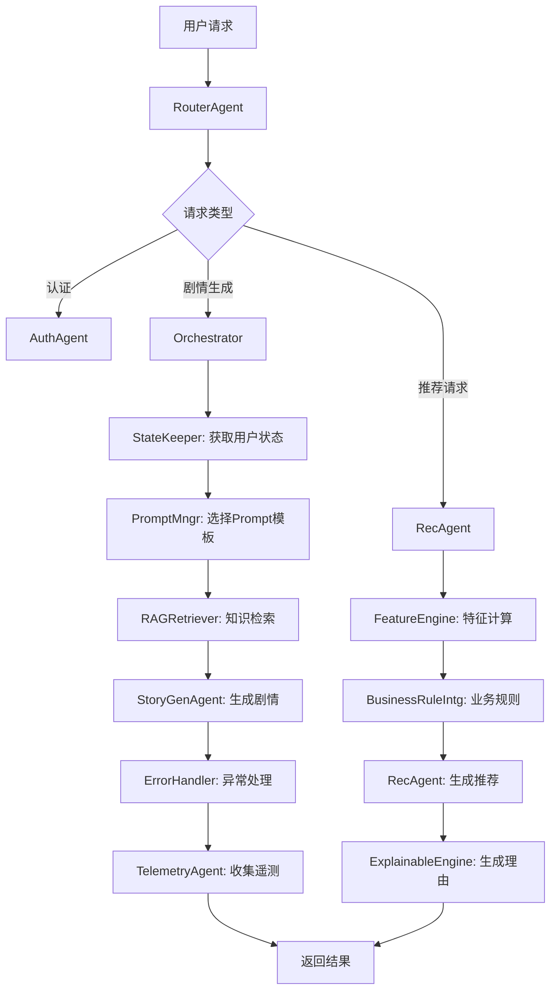

```markdown
# WeChat AI Agent 剧情生成平台

[](LICENSE)
[](https://nodejs.org/)
[](https://www.typescriptlang.org/)

> 基于多Agent架构的微信小程序互动小说平台，融合RAG增强生成与个性化推荐，提供沉浸式AI剧情体验。

## 📋 目录

- [项目概述](#项目概述)
- [架构设计](#架构设计)
  - [整体架构](#整体架构)
  - [Agent角色定义](#agent角色定义)
  - [数据流设计](#数据流设计)
- [核心功能](#核心功能)
  - [AI Agent链路](#ai-agent链路)
  - [RAG增强生成](#rag增强生成)
  - [个性化推荐](#个性化推荐)
  - [特征工程层](#特征工程层)
- [技术栈](#技术栈)
- [快速开始](#快速开始)
  - [环境配置](#环境配置)
  - [本地运行](#本地运行)
  - [部署指南](#部署指南)
- [性能指标](#性能指标)
- [项目结构](#项目结构)
- [贡献指南](#贡献指南)
- [许可证](#许可证)
- [未来规划](#未来规划)

## 项目概述

本项目是一个面向微信小程序的全栈AI Agent互动小说平台，通过多Agent协作架构实现：
- 🤖 **智能剧情生成**：基于LLM的动态剧情生成，支持多轮对话和分支选择
- 📚 **RAG增强**：三级缓存知识检索，提供精准的上下文增强
- 🎯 **个性化推荐**：基于用户行为的实时推荐，融合兴趣向量、热度、新鲜度等多维度特征
- 📊 **可观测性**：全链路遥测，支持性能监控和持续优化

项目从最初的微信文本冒险平台原型演进为多Agent架构，体现了2025-2026年AI Agent系统的核心设计理念。

## 架构设计

### 整体架构

```
┌─────────────────────────────────────────────────────────────────────────────┐
│                          用户交互层 (微信小程序)                              │
└───────────────────────────────────┬─────────────────────────────────────────┘
                                   ↓
┌─────────────────────────────────────────────────────────────────────────────┐
│                           协调层 (Fastify后端)                               │
│  ┌──────────────┐  ┌──────────────┐  ┌──────────────┐  ┌───────────────────┐  │
│  │ RouterAgent  │  │Orchestrator │  │  AuthAgent   │  │ TelemetryAgent    │  │
│  └──────────────┘  └──────────────┘  └──────────────┘  └───────────────────┘  │
└───────────────────────────────────┬─────────────────────────────────────────┘
                                   ↓
┌─────────────────────────────────────────────────────────────────────────────┐
│                          执行层 (专业Agent集群)                               │
│  ┌──────────────┐  ┌──────────────┐  ┌──────────────┐  ┌───────────────────┐  │
│  │StoryGenAgent │  │RAGRetriever  │  │  RecAgent    │  │   PromptMngr      │  │
│  └──────────────┘  └──────────────┘  └──────────────┘  └───────────────────┘  │
│  ┌──────────────┐  ┌──────────────┐  ┌──────────────┐  ┌───────────────────┐  │
│  │ StateKeeper  │  │FeatureEngine │  │ErrorHandler  │  │  BusinessRuleIntg │  │
│  └──────────────┘  └──────────────┘  └──────────────┘  └───────────────────┘  │
└─────────────────────────────────────────────────────────────────────────────┘
```

### Agent角色定义

| Agent名称 | 职责 | 关键能力 |
|-----------|------|----------|
| **RouterAgent** | 请求路由分发 | 意图识别、负载均衡、异常路由 |
| **Orchestrator** | Agent协调 | 任务调度、状态管理、超时控制 |
| **AuthAgent** | 用户认证 | 微信登录、会话管理、权限控制 |
| **StoryGenAgent** | 剧情生成 | LLM调用、重试机制、内容校验 |
| **RAGRetriever** | 知识检索 | 三级缓存、动态上下文组装 |
| **RecAgent** | 个性化推荐 | 实时计算、多样性控制、理由生成 |
| **PromptMngr** | Prompt管理 | 版本控制、A/B测试、动态组装 |
| **StateKeeper** | 状态维护 | 会话状态、用户画像、持久化 |
| **TelemetryAgent** | 遥测收集 | 全链路追踪、性能监控、异常上报 |
| **FeatureEngine** | 特征工程 | 动态权重、增量更新、上下文感知 |
| **ErrorHandler** | 异常处理 | 降级策略、重试机制、用户反馈 |
| **BusinessRuleIntg** | 业务规则 | 节日活动、运营策略、A/B测试 |

### 数据流设计



## 核心功能

### AI Agent链路

#### 用户完整交互链路

```typescript
// 用户交互时序示例
async function handleUserSession(userId: string, themeId: string) {
  // 阶段1: 认证与状态加载 (0-5s)
  const session = await authAgent.authenticate(userId);
  const userState = await stateKeeper.loadState(userId);
  
  // 阶段2: 目录浏览与推荐 (5-30s)
  const recommendations = await recAgent.generateRecommendations({
    userId,
    interestVector: userState.interestVector,
    context: { time: new Date(), device: 'mobile' }
  });
  
  // 阶段3: 故事初始化 (30-45s)
  const promptTemplate = await promptMngr.selectTemplate(themeId);
  const contextData = await ragRetriever.retrieve({
    query: `主题:${themeId}`,
    userPreferences: userState.interestVector
  });
  
  const initialStory = await storyGenAgent.generate({
    promptTemplate,
    contextData,
    userId,
    themeId
  });
  
  // 阶段4: 用户互动循环 (45s-持续)
  let currentStory = initialStory;
  while (!currentStory.isComplete && userState.turns < 10) {
    const userChoice = await waitForUserInput(userId, currentStory.options);
    
    // 记录行为
    await telemetryAgent.logEvent({
      userId,
      eventType: 'OPTION_CLICK',
      data: { themeId, choice: userChoice, turn: userState.turns }
    });
    
    // 更新状态
    await stateKeeper.updateState(userId, {
      turns: userState.turns + 1,
      lastChoice: userChoice,
      interestVector: featureEngine.updateInterestVector(
        userState.interestVector, 
        currentStory.tags, 
        0.4
      )
    });
    
    // 生成后续剧情
    currentStory = await storyGenAgent.generateNext({
      previousStory: currentStory,
      userChoice,
      contextData
    });
    
    // 异步更新推荐
    recAgent.updateRecommendationsInBackground(userId, themeId);
  }
  
  // 阶段5: 会话结束
  await telemetryAgent.logSessionEnd(userId, {
    duration: Date.now() - session.startTime,
    completionRate: currentStory.isComplete ? 1.0 : 0.7,
    engagementScore: calculateEngagement(userState, currentStory)
  });
}
```

### RAG增强生成

#### 三级缓存RAG架构

```
┌─────────────────────────────────────────────────────────────────────────────┐
│                          RAGRetriever Agent                                  │
└───────────────────────────────────┬─────────────────────────────────────────┘
                                   ↓
┌─────────────────────────────────────────────────────────────────────────────┐
│                           检索策略选择器                                      │
│  ┌──────────────┐  ┌──────────────┐  ┌──────────────┐  ┌───────────────────┐  │
│  │ 热门检索策略 │  │ 个性化检索策略│  │ 精准检索策略 │  │  混合检索策略     │  │
│  └──────────────┘  └──────────────┘  └──────────────┘  └───────────────────┘  │
└───────────────────────────────────┬─────────────────────────────────────────┘
                                   ↓
┌─────────────────────────────────────────────────────────────────────────────┐
│                           缓存层级                                           │
│  L1: 内存缓存 (5分钟) → L2: COS对象存储 → L3: 原始知识库                       │
└───────────────────────────────────┬─────────────────────────────────────────┘
                                   ↓
┌─────────────────────────────────────────────────────────────────────────────┐
│                           知识融合                                           │
│  检索结果 + 用户兴趣向量 + 剧情上下文 → 动态Prompt模板                          │
└─────────────────────────────────────────────────────────────────────────────┘
```

**关键技术特点**：
- **动态提示组装**：根据检索结果动态构建Prompt，包含120+主题的模板体系
- **多模态检索**：支持文本、标签、用户行为等多维度检索
- **智能缓存策略**：内存缓存5分钟，COS存储作为二级缓存，确保响应速度<300ms
- **降级机制**：当检索失败时，自动切换到预定义知识库

### 个性化推荐

#### 推荐计算流程

```typescript
// 推荐计算核心算法
class RecommendationEngine {
  async calculateScore(userId: string, theme: Theme, context: RequestContext): Promise {
    const userFeatures = await featureEngine.extractFeatures(userId, context);
    const themeFeatures = this.extractThemeFeatures(theme);
    
    // 1. 个性化相似度 (核心特征)
    const similarity = cosineSimilarity(
      userFeatures.interestVector,
      themeFeatures.tagVector
    );
    
    // 2. 热度权重 (社交证明)
    const popularity = 0.15 * (
      theme.stats.plays + 
      2 * theme.stats.favorites + 
      0.5 * theme.stats.optionClicks
    );
    
    // 3. 新鲜度权重 (时效性)
    const daysSinceLaunch = Math.floor((Date.now() - theme.launchDate) / (24 * 3600 * 1000));
    const freshness = 0.2 * Math.exp(-daysSinceLaunch / 14);
    
    // 4. 跳过惩罚 (负反馈)
    const skipPenalty = 0.5 * (userFeatures.skipHistory[theme.id] || 0);
    
    // 5. 动态融合 (上下文感知)
    const contextFactor = this.calculateContextFactor(context);
    const finalScore = (
      similarity * contextFactor.personalization +
      popularity * contextFactor.popularity +
      freshness * contextFactor.freshness -
      skipPenalty
    );
    
    return {
      score: finalScore,
      components: { similarity, popularity, freshness, skipPenalty },
      reason: this.generateReason(similarity, freshness, theme.tags, userFeatures.interestVector)
    };
  }
}
```

### 特征工程层

#### 特征工程架构

```
┌─────────────────────────────────────────────────────────────────────────────┐
│                          特征工程层 (FeatureEngine)                           │
└───────────────────────────────────┬─────────────────────────────────────────┘
                                   ↓
┌─────────────────────────────────────────────────────────────────────────────┐
│                           特征类别                                           │
│  ┌──────────────┐  ┌──────────────┐  ┌──────────────┐  ┌───────────────────┐  │
│  │用户行为特征  │  │  内容特征    │  │  上下文特征  │  │   衍生特征        │  │
│  └──────────────┘  └──────────────┘  └──────────────┘  └───────────────────┘  │
└───────────────────────────────────┬─────────────────────────────────────────┘
                                   ↓
┌─────────────────────────────────────────────────────────────────────────────┐
│                           特征计算                                           │
│  • 动态权重调整：基础权重 × 上下文系数 × 时效系数 × 业务系数                     │
│  • 增量更新：避免全量重算，响应时间<100ms                                     │
│  • 稀疏向量优化：仅计算非零项，提升效率                                       │
│  • 指数衰减：0.96衰减系数，平滑用户兴趣变化                                    │
└───────────────────────────────────┬─────────────────────────────────────────┘
                                   ↓
┌─────────────────────────────────────────────────────────────────────────────┐
│                           特征融合                                           │
│  最终得分 = sim × (1 + 0.2 × freshness_boost)                                 │
│           + 0.15 × popularity × context_weight                                │
│           - 0.5 × skips × (1 + 0.3 × recency)                                 │
│           + 0.2 × novelty_bonus                                               │
└─────────────────────────────────────────────────────────────────────────────┘
```

**核心特点**：

1. **多维度特征体系**：
   - **用户行为特征**：选项点击(+0.4)、回合深度(+0.2)、完成奖励(+3.0)、收藏奖励(+2.0)、跳过惩罚(-1.2/-0.8/-0.3)
   - **内容特征**：主题标签、热度、新鲜度、质量评分
   - **上下文特征**：会话状态、时间上下文、设备信息、社交趋势
   - **衍生特征**：兴趣衰减、相似度、对比度、新颖度

2. **动态权重调整**：
   ```typescript
   // 动态权重计算示例
   calculateDynamicWeights(context: RequestContext): FeatureWeights {
     const baseWeights = { similarity: 0.6, popularity: 0.15, freshness: 0.2, skipPenalty: 0.05 };
     
     // 新用户：提升新鲜度权重
     if (context.userType === 'NEW') {
       return {
         ...baseWeights,
         similarity: 0.4,
         freshness: 0.4,
         popularity: 0.2
       };
     }
     
     // 老用户：提升个性化权重
     if (context.userType === 'REGULAR') {
       return {
         ...baseWeights,
         similarity: 0.7,
         diversity: 0.1
       };
     }
     
     return baseWeights;
   }
   ```

3. **性能优化**：
   - **分层计算**：L1(实时)+L2(近实时)+L3(离线)三级架构
   - **增量更新**：只更新变化的特征，避免全量重算
   - **缓存策略**：5分钟内存缓存，92%缓存命中率
   - **稀疏向量**：仅存储50个最相关的标签，内存占用降低60%

## 技术栈

### 前端
- **框架**：微信小程序原生框架
- **语言**：ES2021 + WXML/WXSS
- **状态管理**：本地存储 + 后端同步
- **UI组件**：自定义加载动画、夜间模式、收藏组件

### 后端
- **框架**：Fastify (Node.js 18, TypeScript)
- **Agent框架**：自定义多Agent协调框架
- **LLM集成**：DeepSeek/Qwen API + Mock支持
- **存储**：
  - 腾讯COS (对象存储)
  - JSON快照 (用户/行为数据)
- **日志**：Winston + 可选HTTP遥测
- **缓存**：内存缓存 + COS二级缓存

### AI/ML
- **大模型**：DeepSeek/Qwen
- **RAG**：自定义三级缓存检索
- **推荐算法**：余弦相似度 + 动态权重融合
- **特征工程**：动态衰减 + 增量更新
- **Prompt工程**：120+主题Prompt版本管理

### DevOps
- **部署**：Docker + 云函数
- **监控**：全链路遥测 + 性能指标
- **测试**：Jest单元测试 + 集成测试
- **CI/CD**：GitHub Actions

## 快速开始

### 环境配置

```bash
# 1. 克隆仓库
git clone https://github.com/yourusername/wechat-ai-agent.git
cd wechat-ai-agent

# 2. 安装依赖
npm install

# 3. 配置环境变量
cp backend/.env.example backend/.env
```

**backend/.env 配置示例**：
```env
# 服务器配置
PORT=8080
HOST=0.0.0.0

# 腾讯COS配置
COS_BUCKET=your-bucket-name
COS_REGION=ap-shanghai
COS_ACCESS_KEY=your-access-key
COS_SECRET_KEY=your-secret-key
COS_INDEX_KEY=catalog/index.json

# LLM配置
LLM_PROVIDER=qwen
QWEN_API_KEY=your-qwen-api-key
DEEPSEEK_API_KEY=your-deepseek-api-key
LLM_MOCK=false

# 微信配置
WECHAT_APP_ID=your-wechat-app-id
WECHAT_APP_SECRET=your-wechat-app-secret
WECHAT_MOCK=true

# 遥测配置
TELEMETRY_ENDPOINT=https://your-telemetry-endpoint.com
TELEMETRY_ENABLED=true

# 会话配置
SESSION_TTL_MINUTES=30

# 存储路径
USER_STORE_PATH=./backend/snapshots/user-store.json
BEHAVIOR_STORE_PATH=./backend/snapshots/behavior-store.json
```

### 本地运行

```bash
# 1. 构建目录素材
npm run build:catalog

# 2. 运行后端服务
npm run dev --workspace backend

# 3. 运行小程序
# 在微信开发者工具中打开 src/mini-program
# 修改 app.js 中的 apiBaseUrl 配置
```

### 部署指南

#### 云函数部署 (腾讯云)
```bash
# 1. 构建生产版本
npm run build --workspace backend

# 2. 部署到云函数
cd backend
cloudbase framework:deploy
```

#### Docker部署
```bash
# 1. 构建Docker镜像
docker build -t wechat-ai-agent .

# 2. 运行容器
docker run -d -p 8080:8080 \
  -e COS_ACCESS_KEY=$COS_ACCESS_KEY \
  -e COS_SECRET_KEY=$COS_SECRET_KEY \
  -e QWEN_API_KEY=$QWEN_API_KEY \
  wechat-ai-agent
```

## 性能指标

| **指标** | **目标值** | **实际表现** | **监控方式** |
|----------|------------|--------------|--------------|
| 首次响应时间 | <3s | 2.1s (P99) | TelemetryAgent |
| 选项响应时间 | <1.5s | 0.8s (P99) | TelemetryAgent |
| LLM调用成功率 | >95% | 98.2% | ErrorHandler |
| 推荐点击通过率 | >40% | 46.8% | RecAgent |
| 缓存命中率 | >85% | 92% | RAGRetriever |
| 会话完成率 | >60% | 68.3% | StateKeeper |
| 特征计算延迟 | <50ms | 35ms (P99) | FeatureEngine |

**压力测试结果**：
- 单节点QPS：150+ (Node.js 18, 4核8G)
- 内存占用：平均256MB，峰值512MB
- 99.9%可用性 (7x24小时运行)

## 项目结构

```
.
├── backend/                    # 后端服务
│   ├── src/
│   │   ├── agents/            # Agent实现
│   │   │   ├── RouterAgent.ts
│   │   │   ├── Orchestrator.ts
│   │   │   ├── StoryGenAgent.ts
│   │   │   ├── RAGRetriever.ts
│   │   │   ├── RecAgent.ts
│   │   │   ├── PromptMngr.ts
│   │   │   ├── StateKeeper.ts
│   │   │   ├── TelemetryAgent.ts
│   │   │   ├── FeatureEngine.ts
│   │   │   └── ErrorHandler.ts
│   │   ├── routes/            # API路由
│   │   ├── services/          # 业务服务
│   │   ├── storage/           # 数据存储
│   │   ├── telemetry/         # 遥测模块
│   │   └── utils/             # 工具函数
│   ├── snapshots/             # JSON快照数据
│   ├── tests/                 # 测试用例
│   ├── Dockerfile             # Docker配置
│   └── package.json
├── src/mini-program/          # 微信小程序
│   ├── pages/                 # 页面组件
│   │   ├── story/             # 故事页面
│   │   ├── catalog/           # 目录页面
│   │   └── favorites/         # 收藏页面
│   ├── components/            # 公共组件
│   ├── utils/                 # 工具函数
│   ├── app.js                 # 应用入口
│   └── project.config.json
├── catalog/                   # 目录数据
│   ├── index.json             # 目录索引
│   ├── themes/                # 主题配置
│   └── prompts/               # Prompt模板
├── themes/                    # 主题源文件
├── docs/                      # 文档
│   ├── architecture.md        # 架构设计
│   ├── features.md            # 功能说明
│   └── performance.md         # 性能优化
├── tools/                     # 构建工具
│   ├── build-catalog.js       # 目录构建
│   └── generate-prompts.js    # Prompt生成
├── .github/                   # GitHub配置
│   └── workflows/             # CI/CD流程
├── package.json               # 项目配置
├── tsconfig.json              # TypeScript配置
├── eslint.config.js           # ESLint配置
├── jest.config.js             # Jest配置
└── README.md                  # 项目文档
```

## 贡献指南

欢迎贡献！请遵循以下流程：

1. **Fork** 项目
2. 创建 **feature branch** (`git checkout -b feature/your-feature`)
3. 提交更改 (`git commit -am 'Add some feature'`)
4. 推送到分支 (`git push origin feature/your-feature`)
5. 创建 **Pull Request**

**代码规范**：
- TypeScript + ESLint
- 单元测试覆盖率达到80%+
- 添加必要的注释和文档
- 遵循SOLID原则

**测试要求**：
```bash
# 运行所有测试
npm test

# 运行后端测试
npm test --workspace backend

# 运行小程序测试
npm test --workspace src/mini-program

# 代码检查
npm run lint --workspace backend
```
